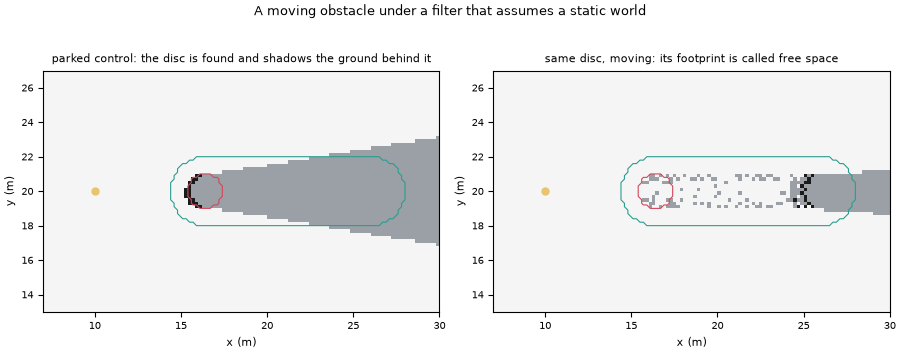
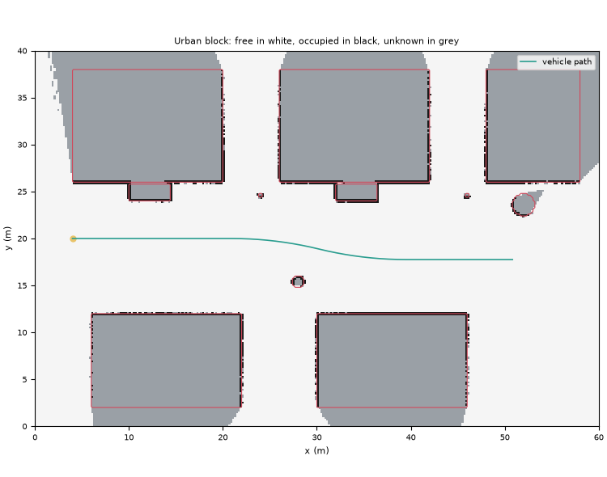
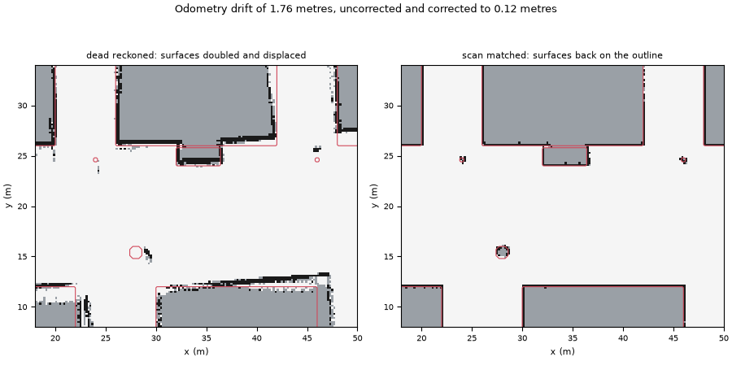

# Occupancy Grid Freespace

Bird's-eye-view free space estimation from simulated lidar using an inverse sensor model,
built to measure where the model breaks rather than only where it works.

[](https://github.com/Eelis03/occupancy-grid-freespace/actions/workflows/ci.yml)
[](https://www.python.org/downloads/)
[](LICENSE)



## A moving obstacle is missed, not smeared

The usual complaint about a static world assumption is that a moving object leaves a
smear. That is not the dominant failure here, and the figure above is the measurement.
Both panels are the same disc of radius 1 metre, the same sensor, the same seed, the same
41 sweeps. On the left it is parked where the moving one ends up, and the map finds it and
shadows the ground behind it. On the right it approached that spot at 1.2 metres per
second, and the map has drawn it where it was several seconds ago and calls the ground it
is standing on free space. A planner reading the right hand panel drives into it.

From `uv run python examples/dynamic_smear.py`, with a stationary sensor so that nothing
in the table is caused by the sensor's own motion:

```
case         swept (m)  parked (m)  moving (m)  smear (m)  smear/swept  stale cells  stale (m2)  footprint  found  unknown  called free  parked finds  peak returns
-----------  ---------  ----------  ----------  ---------  -----------  -----------  ----------  ---------  -----  -------  -----------  ------------  ------------
approaching  9.60       1.00        1.20        0.20       0.021        15           0.60        80         0      20       60           12            2
receding     9.60       0.80        1.20        0.40       0.042        7            0.28        80         8      72       0            8             3
crossing     12.80      1.80        1.00        -0.80      -0.063       4            0.16        80         0      1        79           10            5
```

The smear is 0.20 to 0.40 metres, 2 to 4 percent of the distance travelled. The miss is
total: of the 80 cells of the obstacle's true final footprint, the approaching case finds
0 and calls 60 free, and the crossing case finds 0 and calls 79 free.

The arithmetic says why. The accumulated log odds are clamped at probabilities 0.12 and
0.97, the defaults published with octomap, and those two bounds fix two constants that
decide almost everything the filter does: one occupied observation is undone by 2.09 free
observations, and a cell already saturated at the free clamp needs 3.08 consecutive
occupied observations before it can be called occupied. The `peak returns` column is the
largest number of range returns any single cell in the region received over the whole run.
In the approaching case it is 2. The obstacle never had the evidence to overturn ground
the filter had already decided was empty.

The crossing case does reach 5, more than the 3.08 needed, and cells along its path were
called occupied while the disc stood over them. They do not survive. Lateral motion
carries the trail out of the obstacle's own shadow, later sweeps see straight through it,
2.09 free observations undo each occupied one, and 4 stale cells are left at the end. The
map is not smearing the obstacle so much as running behind it.

The receding case looks better than it is. It calls nothing free, but only because its
final footprint spent the whole run inside the obstacle's own shadow and accumulated no
free evidence to be wrong about: 72 of its 80 cells are reported unknown. Unknown is the
safe failure, since a planner that treats unknown as impassable is not endangered by it,
but it is not a detection either.

## One parameter controls both failures

The smear and the miss are two ends of the free clamp. Sweeping it on the approaching
case, everything else held fixed, from the same command:

```
clamp  occ obs needed  smear (m)  stale (m2)  found  unknown  called free  parked finds
-----  --------------  ---------  ----------  -----  -------  -----------  ------------
0.05   4.21            0.20       0.60        0      0        80           12
0.12   3.08            0.20       0.60        0      20       60           12
0.20   2.37            0.20       0.60        0      80       0            12
0.28   1.85            9.00       3.24        20     60       0            12
0.34   1.51            9.00       3.44        22     58       0            12
```

At a clamp of 0.05 the filter is so certain the corridor is empty that all 80 footprint
cells are still called free with the obstacle standing in them. Loosening it converts
those cells first to unknown and then, once one or two occupied observations suffice, to
found. The bill arrives at exactly that point: at 0.28 the map grows a 9.00 metre streak
of stale occupancy behind the obstacle, 94 percent of the 9.60 metres it travelled,
together with 3.24 square metres of ground wrongly held occupied. The streak survives
because an approaching obstacle occludes the cells it has just left, so no later beam ever
contradicts them. It is absent from the receding case at every clamp, because there the
trail lies between the sensor and the obstacle and is corrected on the next sweep.

No row of that sweep gives both a found obstacle and no streak. The trade is not an
artefact of poor tuning, and it is not a threshold that a careful engineer could place
better.

Two ceilings bound what any setting could ever buy. The `parked finds` column is 12 at
every clamp: a stationary disc of 80 footprint cells yields 12 of them to a lidar, because
a beam stops at the near surface and the interior and far side are never measured. The
moving runs reach 22 at the loosest clamps, slightly more than the parked control, because
the obstacle's motion sweeps its near surface across a thicker band before it stops. Under
no setting is the other 58 recoverable by a filter, however it is tuned. Removing the
failure needs a filter that models motion instead of assuming its absence, which this one
deliberately does not; `docs/design-notes.md` names the three ways of doing that and what
each would cost.

## The filter underneath

The map holds one number per cell, the log odds of occupancy. This is the construction of
Moravec and Elfes as presented by Thrun, Burgard and Fox: rather than inverting the
forward sensor model, the inverse model is written down directly, with the cells a beam
passed through assigned a probability below the prior and the cell the beam terminated in
assigned one above it. In log odds each observation is an addition, so a whole sweep
reduces to a sparse array of increments and the posterior is recovered by a logistic
transform only when it is needed.

Three decisions fix its behaviour.

**The occupied increment is applied only where a beam carries a range return.** A beam
that returns nothing certifies free space out to the range limit and says nothing whatever
about the cell at the limit. Treating that cell as occupied paints a wall on the sensor
horizon; discarding the beam throws away the free space evidence that matters most,
because unreturned beams are the ones that crossed open ground. In the run reported below,
11699 of 35976 beams reach the limit, so this is a third of all the evidence in the map.
The two cases differ in exactly one cell:

```python
import numpy as np

from freespace_grid import GridSpec, scan_update

spec = GridSpec(resolution=1.0, rows=21, cols=21, origin_x=-10.5, origin_y=-10.5)
endpoint = np.array([[6.2, 0.0]])

with_return = scan_update(spec, np.zeros(2), endpoint, np.array([True]))
at_limit = scan_update(spec, np.zeros(2), endpoint, np.array([False]))

print(with_return.free_cells.shape[0], with_return.occupied_cells.shape[0])
# 6 1
print(at_limit.free_cells.shape[0], at_limit.occupied_cells.shape[0])
# 7 0
```

**Cells are enumerated by the digital differential analyser of Amanatides and Woo.** It
visits every cell the segment enters, which a Bresenham line does not: Bresenham skips
cells at shallow crossings and would leave holes in the free space. The implementation
loops over steps and vectorises over rays, so a 720 beam sweep costs a few hundred array
operations rather than 720 Python iterations. Where a ray passes exactly through a grid
corner the traversal steps x and then y, visiting the horizontally adjacent cell, because
cutting the corner would let free space leak diagonally through a wall one cell thick.

**A grid that follows the vehicle is re-anchored by whole cells.** Three policies are
implemented and compared: snapping the window origin to whole cells, which makes every
shift an exact array translation, and centring the window exactly on the vehicle with
either bilinear or nearest neighbour resampling. Interpolation is applied to log odds
rather than to probability, because log odds is the additive coordinate of the filter, so
a linear blend of log odds is a geometric mean of odds and leaves the prior fixed.

Building and scoring a map is one call each:

```python
from freespace_grid import run_mapping, score_grid, urban_block

scenario = urban_block()
trace = run_mapping(scenario)
agreement = score_grid(trace.grid, trace.truth, scenario.model, region=trace.observed_mask)

print(len(trace.steps), trace.totals()["max_range_beams"])
# 51 11699
print(
    round(agreement.decided_fraction, 4),
    round(agreement.free_agreement, 4),
    round(agreement.occupied_agreement, 4),
)
# 0.9831 0.9865 0.9923
```

## Installation

Requires Python 3.12 or later. Continuous integration runs the whole suite on 3.12 and
3.13, on Linux and on Windows, so the version floor in `pyproject.toml` is a tested claim
rather than a declared one.

```bash
git clone https://github.com/Eelis03/occupancy-grid-freespace.git
cd occupancy-grid-freespace
uv sync
```

Using pip instead of uv:

```bash
python -m venv .venv
.venv/bin/activate      # Windows: .venv\Scripts\activate
pip install -e ".[dev]"
```

## Reproducing every number here

Every figure and every table below is the output of one of these six commands. Together
they take about half a minute.

```bash
uv run python examples/map_static_scene.py     # the static map and its scores
uv run python examples/sweep_agreement.py      # threshold and spatial tolerance sweeps
uv run python examples/compare_grid_frames.py  # the four ways of maintaining the grid
uv run python examples/dynamic_smear.py        # the moving obstacle and the clamp sweep
uv run python examples/pose_drift.py           # odometry drift and its correction
uv run python examples/publish_figures.py      # regenerates docs/figures
```

Each accepts `--steps` to shorten the run, and the ones that draw accept `--outdir` and,
except for `publish_figures.py`, `--no-figure`.

The three images in `docs/figures` are snapshots, not build artefacts. `uv run python
examples/publish_figures.py` regenerates all three in place and prints their sizes: they
total 73.6 KiB against a budget of 250 KiB, which is why they can be tracked at all. Each
is a flat colour decision map, so a modest resolution loses nothing and no compression
dependency is needed. CI does not compare them
byte for byte: matplotlib renders text through whatever font stack the machine provides
and its PNG output is not reproducible across platforms, so a byte comparison would fail
on one of the two runners for a reason that has nothing to do with this code. The test
suite asserts instead that the three files exist, that nothing else has crept into the
directory, and that the total stays inside the budget.

The numbers were produced on Python 3.12.10 with numpy 2.5.1, scipy 1.18.0 and matplotlib
3.11.1, on one core of an AMD64 desktop under Windows 11. Every run is seeded.

## Results

The `urban_block` scenario is a 60 by 40 metre street block mapped at 0.2 metres per cell,
so the grid is 200 by 300 cells. Five building footprints bound a twelve metre corridor,
with two parked vehicles, two poles, a bin and a planter near its edges. The vehicle
drives the corridor end to end at 4.7 metres per second over 51 sweeps, along a straight
section, a right hand arc, a left hand arc and a second straight section. The sensor is a
360 degree planar lidar with 720 beams, a 30 metre range limit, 0.03 metre Gaussian range
noise and a 2 percent beam dropout rate. The filter uses free and occupied probabilities
of 0.4 and 0.7, clamps at 0.12 and 0.97, and a decision threshold of 0.65.

A map is judged on three numbers, not one: what fraction of the scored cells it is
prepared to decide, what fraction of the truly free decided cells it calls free, and what
fraction of the truly occupied decided cells it calls occupied. Any one of them can be
driven to an arbitrary value by moving the threshold, so a sweep is reported rather than a
point.

### The static map



From `uv run python examples/map_static_scene.py`:

```
quantity             value
-------------------  --------------
sweeps               51
beams retained       35976
range returns        24277
range limit returns  11699
beams dropped        744
cell visits          3135805
cells observed       35482 of 60000

region      cells  decided  free agr  occ agr  balanced
----------  -----  -------  --------  -------  --------
observed    35482  0.9831   0.9865    0.9923   0.9894
whole grid  60000  0.5814   0.9865    0.9923   0.9894
```

The two regions answer two different questions, and the figure is why both have to be
reported. Over the 35482 cells at least one beam reached, the map decides 98.31 percent
and is right about 98.65 percent of the free ones and 99.23 percent of the occupied ones.
Over the whole grid the decided fraction falls to 58.14 percent. That difference is
coverage, not error: the missing 24518 cells are the grey blocks in the figure, building
interiors and the ground behind them, which no beam can reach from the corridor.

### The decision threshold, and how little it buys

Scored over the observed region, from `uv run python examples/sweep_agreement.py`:

```
threshold  decided  free agr  occ agr  balanced  free as occ  occ as free
---------  -------  --------  -------  --------  -----------  -----------
0.55       0.9986   0.9853    0.9814   0.9833    510          15
0.62       0.9841   0.9861    0.9911   0.9886    475          7
0.65       0.9831   0.9865    0.9923   0.9894    459          6
0.68       0.9819   0.9871    0.9923   0.9897    438          6
0.72       0.9679   0.9872    0.9943   0.9907    432          4
0.78       0.9534   0.9883    0.9957   0.9920    386          3
0.82       0.9511   0.9896    0.9957   0.9926    344          3
0.86       0.9380   0.9898    0.9953   0.9925    334          3
```

The trade is visible and it is shallow: raising the threshold from 0.55 to 0.86 buys 1.4
percentage points of occupied agreement and costs 6.1 points of coverage. The shallowness
is itself the result and it comes from the clamp. Most observed cells are pinned at one
bound or the other, 92.71 percent of them, so moving the threshold inside the interval
reclassifies only the small population in between. The sweep stops at 0.86 because a free
clamp of 0.12 puts a hard ceiling of 0.88 on any threshold that could ever call a cell
free, and `LogOddsModel` raises an error rather than accepting a threshold it can never
meet.

### Where the occupied errors are

Same command, threshold held at 0.65. A tolerance of `k` cells counts a truly occupied
cell as agreeing when the map called some cell within `k` of it occupied:

```
tolerance  decided  free agr  occ agr  balanced  free as occ  occ as free
---------  -------  --------  -------  --------  -----------  -----------
0          0.9831   0.9865    0.9923   0.9894    459          6
1          0.9831   0.9865    0.9949   0.9907    459          6
2          0.9831   0.9865    0.9974   0.9920    459          6
3          0.9831   0.9865    0.9987   0.9926    459          6
```

One cell of slack recovers only 0.26 percentage points, so the surfaces this map places
are in the right cell rather than one cell out. That is worth measuring because a one cell
offset is the expected failure here: a range return is attributed to the cell containing
the measured point while the ground truth labels a cell by whether its centre lies inside
an obstacle, and those two conventions disagree whenever a surface falls near a cell
boundary. The 459 free cells called occupied, 1.35 percent of the free ones, are dominated
by the same effect at building corners, where the beam grazes the facade and the return
lands in the first cell outside it.

### Maintaining the grid under vehicle motion

From `uv run python examples/compare_grid_frames.py`. The ego window is 200 by 200 cells.
The vehicle advances 4.7 cells per sweep, chosen so that a window centred exactly on it
never lands on a whole cell offset:

```
policy        shifts  lossless  decided  free agr  occ agr  at clamp  edge contrast
------------  ------  --------  -------  --------  -------  --------  -------------
world fixed   0       0         0.9831   0.9865    0.9923   0.9271    1.481
ego snap      50      50        0.9516   0.9907    0.9883   0.8224    1.614
ego bilinear  50      0         0.9448   0.9960    0.9226   0.8036    1.180
ego nearest   50      0         0.9464   0.9954    0.6038   0.8092    1.174
```

Snapping the window origin to whole cells makes all 50 shifts lossless copies and costs
0.40 points of occupied agreement against the world fixed grid, all of it from cells that
fell off the trailing edge. Centring the window exactly costs far more. Bilinear
resampling drops occupied agreement to 0.9226 and edge contrast from 1.614 to 1.180: each
frame averages every obstacle surface with its free surroundings, the filters compose over
50 frames, and a wall one cell thick is spread until it no longer clears the threshold.
Nearest neighbour introduces no blur, which its almost identical edge contrast of 1.174
does not distinguish, but it displaces every cell by up to half a cell every frame, and
after 50 frames of that jitter only 0.6038 of the occupied cells survive, the worst figure
in the table.

The lesson is not that interpolation is bad but that centring exactly is not worth what it
costs. A snapped window is never more than half a cell off centre, 0.1 metres here, which
no consumer of the map can detect, and it buys exact arithmetic. Both fractional policies
also raise the free agreement, to 0.9960 and 0.9954, because smoothing removes isolated
spurious occupied cells along with the real thin ones. An occupancy figure that improves
while the map gets worse is a good reason to report both classes separately.

## Pose drift, and what correcting it costs



Everything above is measured with exact poses. That was a stated limitation of this
repository and it is now closed: `pipeline/odometry.py` corrupts the body frame motion
between consecutive poses so the estimate handed to the mapper drifts and compounds, and
`algorithm/scan_match.py` corrects it by correlative scan to map matching, scoring
candidate poses by how well the sweep's range returns land on the occupied evidence the
map already holds.

From `uv run python examples/pose_drift.py`. Scale 1.0 is 2 percent of the distance
travelled in translation and 0.23 degrees per metre in heading, the order of magnitude of
wheel odometry with no inertial aiding. The same variates are drawn at every scale, so the
rows are one accident of the seed at four amplitudes rather than four separate accidents:

```
scale  poses          final err (m)  peak err (m)  heading err (deg)  decided  free agr  occ agr  edge contrast
-----  -------------  -------------  ------------  -----------------  -------  --------  -------  -------------
exact  given          0.000          0.000         0.00               0.9831   0.9865    0.9923   1.481
0.0    dead reckoned  0.000          0.000         0.00               0.9831   0.9865    0.9923   1.481
0.0    matched        0.141          0.141         0.00               0.9852   0.9888    0.9517   1.226
1.0    dead reckoned  0.880          0.880         2.25               0.9762   0.9867    0.5953   1.044
1.0    matched        0.165          0.175         0.00               0.9850   0.9891    0.9263   1.234
2.0    dead reckoned  1.759          1.759         4.49               0.9642   0.9867    0.4168   0.833
2.0    matched        0.123          0.162         0.01               0.9849   0.9889    0.9577   1.229
4.0    dead reckoned  3.515          3.515         8.98               0.9511   0.9888    0.2390   0.547
4.0    matched        0.130          0.205         0.02               0.9851   0.9893    0.9680   1.233
```

Three things in that table are worth more than the headline.

The damage has a shape, not only a size. At a final drift of 1.759 metres the occupied
agreement collapses from 0.9923 to 0.4168 while the free agreement does not move at all,
0.9865 against 0.9867. Free space is a thick region and survives being displaced by a
metre, because most of it is still inside itself. A surface is one cell thick and a metre
puts it somewhere else entirely, which is what the left hand panel of the figure shows:
every wall drawn twice, once from before the drift and once from after.

The correction is not free even when there is nothing to correct. The `0.0 matched` row is
an exact odometry put through the matcher anyway, and it ends 0.141 metres from the truth
and 4.1 points of occupied agreement down, 0.9923 to 0.9517. The matcher aligns each sweep
with the discretised map rather than with the world, and the map's occupied cells sit on
the near surface of every obstacle, up to a cell from where the truth says it is. That
bias is a floor rather than a residue of the input: the matcher finishes between 0.12 and
0.17 metres from the truth whether it started 0 or 3.515 metres away. Exact poses therefore
remain the default for every other result here, and the odometry path is skipped entirely
rather than run with its coefficients at zero, so no number above moved when this was
added.

The `0.0 dead reckoned` row is the check that says so. It runs the whole odometry
apparatus with every coefficient zero and reproduces the exact pose run to four decimal
places on all four measures.

What remains is loop closure. The matcher localises against the map it is building and
never revises a sweep it has already integrated, so an error it accepts is permanent and a
place revisited after a long excursion cannot pull the earlier map back into agreement.
The corridor here is driven once end to end, so the case does not arise in these numbers,
which is exactly why it is written down in `docs/design-notes.md` rather than demonstrated.

## Modules and tests

| Module | Responsibility |
| --- | --- |
| `src/freespace_grid/model/grid.py` | `GridSpec` and the world to cell mapping, its inverse, bulk cell centres, and bounds tests. |
| `src/freespace_grid/model/logodds.py` | `LogOddsModel`: increments, asymmetric clamps, decision band, and the closed form observation counts. |
| `src/freespace_grid/model/transform.py` | `Pose2D` and the SE(2) operations, written elementwise so no BLAS kernel is involved. |
| `src/freespace_grid/model/occupancy.py` | The `OccupancyGrid` container and the three way `CellState` decision rule. |
| `src/freespace_grid/model/typing.py` | Array type aliases shared by every layer. |
| `src/freespace_grid/algorithm/raycast.py` | Vectorised Amanatides and Woo grid traversal for a bundle of rays. |
| `src/freespace_grid/algorithm/inverse_sensor.py` | One sweep reduced to disjoint free and occupied cell sets, including the range limit case. |
| `src/freespace_grid/algorithm/accumulation.py` | `Accumulator`, whole cell translation, and the three window re-anchoring policies. |
| `src/freespace_grid/algorithm/scan_match.py` | The likelihood field and the coarse to fine correlative pose search. |
| `src/freespace_grid/pipeline/scene.py` | Circle and polygon obstacles, closed form ray intersection, and ground truth rasterisation. |
| `src/freespace_grid/pipeline/lidar.py` | `LidarSpec` and `Scan`: noise, dropout, minimum range, and range limit returns. |
| `src/freespace_grid/pipeline/trajectory.py` | Exact unicycle integration and even subsampling of a trajectory. |
| `src/freespace_grid/pipeline/odometry.py` | `OdometryNoise` and dead reckoning of a corrupted body frame increment. |
| `src/freespace_grid/pipeline/scenarios.py` | The named scenarios, static and dynamic, and the parameters that define them. |
| `src/freespace_grid/pipeline/runner.py` | The trajectory loop and the `MappingTrace` it records. |
| `src/freespace_grid/analysis/metrics.py` | `Agreement`, the threshold sweep, and the spatial tolerance sweep. |
| `src/freespace_grid/analysis/smear.py` | Region of interest construction, smear measurement, and the moving against parked comparison. |
| `src/freespace_grid/analysis/sharpness.py` | Clamp saturation and edge contrast, used to measure resampling loss. |
| `src/freespace_grid/analysis/report.py` | Rendering of measurement records as the tables above. |
| `src/freespace_grid/analysis/figures.py` | The figures. The only module that imports matplotlib. |
| `examples/` | Wiring scripts, no logic. |

Each layer depends only on the ones above it. The model layer performs no input or output
and knows nothing about sensors; the algorithm layer draws nothing and simulates nothing;
the pipeline layer scores nothing. `src/freespace_grid/py.typed` is present, so an
application that installs this package receives the annotations mypy checks here rather
than `Any`.

```bash
uv run pytest --cov=src/freespace_grid --cov-report=term-missing
uv run ruff check .
uv run ruff format --check .
uv run mypy
```

174 tests run in under thirty seconds and cover 1228 of 1382 statements, which the report
rounds to 89 percent and is 88.86 percent before rounding. CI runs that exact command with
`--cov-fail-under=86`, the measured figure rounded down and reduced by two, so that a
platform difference does not fail the build while a module falling out of test does. The
one large gap is deliberate: `analysis/figures.py` reports zero because it is only ever
reached through the example scripts, and the suite runs those as subprocesses so that they
are exercised through the same entry point a reader uses.

The suite has three tiers. The first checks the mathematics as properties: that the world
to cell mapping round trips exactly at every cell centre of four different grids, that a
single beam visits exactly the cells a hand computed crossing sequence names and exactly
the cells a dense sampling of the segment falls in, that a range limit beam marks free
space along its whole traversal and nothing occupied, that a whole cell window shift is a
bit exact copy under all three interpolation settings, that a closed room converges to
free interior and occupied walls with zero error, and that a displaced scan is pulled back
to within half a cell by the matcher.

The second compares `tests/data/reference_run.json` against a fresh run. Its module
docstring states which quantities are pinned exactly, which to a tolerance, and why: beam
and dropout counts come from a bit exact seeded stream and are compared exactly, counts
derived from trigonometry are allowed two cells or one part in five hundred, and the
orderings the experiments exist to demonstrate are asserted as inequalities rather than
pinned as numbers.

The third runs each script in `examples/` as a subprocess under a reduced step count,
checks that it exits cleanly and writes nothing to standard error, and checks that it puts
its figures where it was asked and writes none when told not to. A test fails if a script
is added to `examples/` without being listed, and another fails if the tracked figures go
missing or outgrow their budget.

## What this does not do

`docs/design-notes.md` records the alternatives that were rejected, the limitation that
was closed and what closing it cost, and the ones that remain open. The short version of
the last: cells are treated as independent so isolated errors are not suppressed, the map
is two dimensional on flat ground, there is no loop closure, and the simulator has one
return per beam with no divergence, intensity, multipath or weather.

## References

Algorithms:

- H. P. Moravec and A. Elfes, "High resolution maps from wide angle sonar",
  Proceedings of the IEEE International Conference on Robotics and Automation, 1985,
  pages 116 to 121. DOI [10.1109/ROBOT.1985.1087316](https://doi.org/10.1109/ROBOT.1985.1087316)
- A. Elfes, "Using occupancy grids for mobile robot perception and navigation",
  Computer 22(6), 1989, pages 46 to 57.
  DOI [10.1109/2.30720](https://doi.org/10.1109/2.30720)
- S. Thrun, W. Burgard and D. Fox, "Probabilistic Robotics", MIT Press, 2005,
  chapter 9, "Occupancy grid mapping", and chapter 5 for the odometry motion model.
  <https://mitpress.mit.edu/9780262201629/probabilistic-robotics/>
- J. Amanatides and A. Woo, "A fast voxel traversal algorithm for ray tracing",
  Proceedings of Eurographics 1987, pages 3 to 10.
  <https://www.cse.yorku.ca/~amana/research/grid.pdf>
- J. E. Bresenham, "Algorithm for computer control of a digital plotter",
  IBM Systems Journal 4(1), 1965, pages 25 to 30.
  DOI [10.1147/sj.41.0025](https://doi.org/10.1147/sj.41.0025)
- A. Hornung, K. M. Wurm, M. Bennewitz, C. Stachniss and W. Burgard, "OctoMap: an
  efficient probabilistic 3D mapping framework based on octrees", Autonomous Robots
  34(3), 2013, pages 189 to 206.
  DOI [10.1007/s10514-012-9321-0](https://doi.org/10.1007/s10514-012-9321-0)
- E. B. Olson, "Real-time correlative scan matching", Proceedings of the IEEE
  International Conference on Robotics and Automation, 2009, pages 4387 to 4393.
  DOI [10.1109/ROBOT.2009.5152375](https://doi.org/10.1109/ROBOT.2009.5152375)
- S. Kohlbrecher, O. von Stryk, J. Meyer and U. Klingauf, "A flexible and scalable SLAM
  system with full 3D motion estimation", IEEE International Symposium on Safety,
  Security and Rescue Robotics, 2011, pages 155 to 160.
  DOI [10.1109/SSRR.2011.6106777](https://doi.org/10.1109/SSRR.2011.6106777)
- D. Hahnel, R. Triebel, W. Burgard and S. Thrun, "Map building with mobile robots in
  dynamic environments", Proceedings of the IEEE International Conference on Robotics
  and Automation, 2003, pages 1557 to 1563.
  DOI [10.1109/ROBOT.2003.1241816](https://doi.org/10.1109/ROBOT.2003.1241816)
- R. Danescu, F. Oniga and S. Nedevschi, "Modeling and tracking the driving environment
  with a particle-based occupancy grid", IEEE Transactions on Intelligent
  Transportation Systems 12(4), 2011, pages 1331 to 1342.
  DOI [10.1109/TITS.2011.2158097](https://doi.org/10.1109/TITS.2011.2158097)
- E. Haines and T. Akenine-Moller, editors, "Ray Tracing Gems", Apress, 2019,
  chapter 6, on ray and disc intersection in floating point.
  DOI [10.1007/978-1-4842-4427-2](https://doi.org/10.1007/978-1-4842-4427-2)

Dependencies:

- [numpy](https://numpy.org/) (BSD 3-Clause). All array arithmetic, the vectorised ray
  traversal, the geometric predicates, and the seeded PCG64 generator that makes every
  run reproducible.
- [scipy](https://scipy.org/) (BSD 3-Clause). `scipy.ndimage.map_coordinates` for grid
  resampling and for sampling the likelihood field, `gaussian_filter` for building it, and
  `binary_dilation` and `binary_erosion` for the spatial tolerance and the boundary band.
- [matplotlib](https://matplotlib.org/) (matplotlib license, a BSD-style permissive
  license). The figures in the analysis layer, used with the Agg backend so the
  examples need no display.
- [pytest](https://docs.pytest.org/) and [pytest-cov](https://pytest-cov.readthedocs.io/)
  (MIT), [ruff](https://docs.astral.sh/ruff/) (MIT), and [mypy](https://mypy-lang.org/)
  (MIT). Development only: test running, coverage measurement, linting, and type checking.

## License

Released under the MIT license. See [LICENSE](LICENSE).
